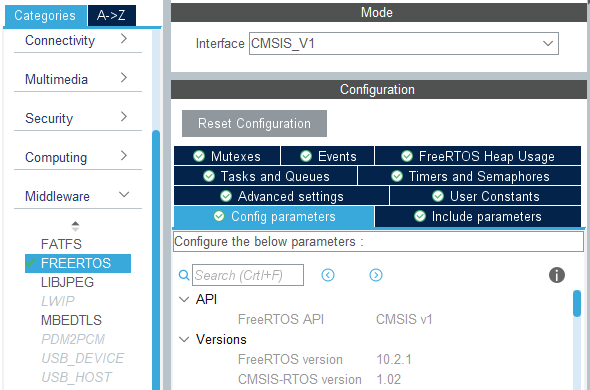
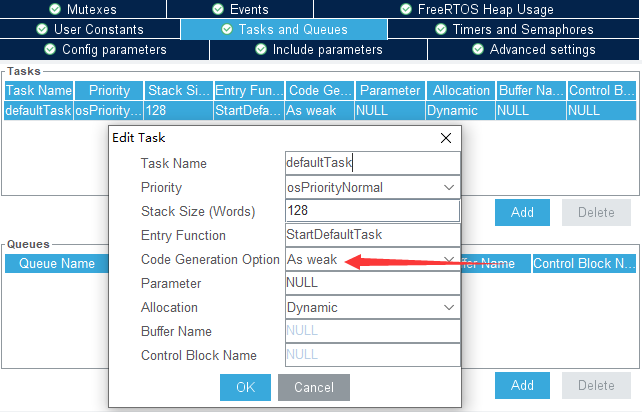
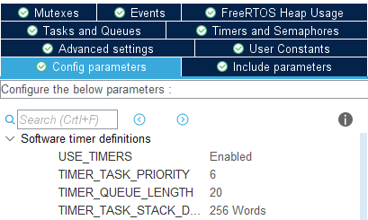
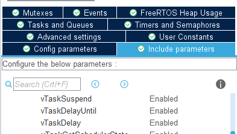
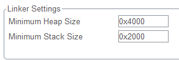
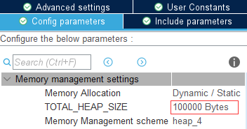
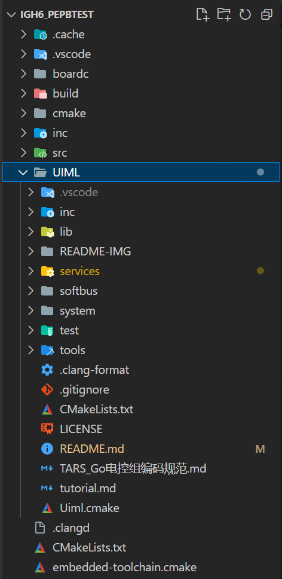

# UIML 使用步骤

**本节讲述初次上手时如何进行 UIML 项目的创建和配置**

1. 创建工程并移植 FreeRTOS 系统。推荐使用 STM32CubeMX 进行代码工程的生成和 FreeRTOS 的配置 [>>>](#使用CubeMX创建工程并配置FreeRTOS)
2. 将所有所需的文件添加至工程中 [>>>](#添加项目文件)
3. 根据各模块的说明文档，使用指定的格式编写系统配置文件 [>>>](#编写系统配置文件)
4. 根据功能需求编写用户逻辑

### 使用 CubeMX 创建工程并配置 FreeRTOS

1. **创建新工程**，选择所需芯片，配置时钟树，此处不详述操作细节
   > 注：请勾选将外设驱动代码生成到独立的.c/h 文件中
2. 根据 UIML 的外设周边模块说明文档**进行外设配置**，此处不详述操作细节
3. **配置 FreeRTOS**，以下简要介绍操作过程

   - 使能 FreeRTOS，选择为`CMSIS_V1`版本

     

   - 将初始任务的`Code Generation Option`设置为`As weak`，不需要额外添加任何其他任务

     

   - 打开软件定时器，并将其优先级设置为 6，定时器队列大小设置为 20

     

   - 开启`vTaskDelayUntil`

     

   - 修改堆栈大小，建议的系统堆栈和 RTOS 堆大小为如下图所示（针对 C 板）

     
     

## 添加项目文件

1. 将 UIML 源码目录复制到 PEPB 项目根目录。如图：

   

2. 在项目根目录的 CMakeLists.txt 中添加代码来将 UIML 链接到项目中。你需要参考[example/CopyThisToMainProject.cmake](example/CopyThisToMainProject.cmake)中的内容，将其中的代码添加到项目的 CMakeLists.txt 中，并按需更改标注了需要更改的部分。

   `target_link_uiml` 函数需要更改的参数：

   - `TARGET_NAME` 参数为 UIML 需要链接到的主目标的名称。
   - `CPU_TYPE` 参数为使用的单片机的核心，如`cortex-m4`。
   - `SERVICE_LIST` 参数为你提供的服务列表头文件路径。将在下面进行介绍。
   - `STRICT_MODE` 是一个没有附加参数的可选选项。启用后会在 UIML 中编译进更多的运行时检查，在检测到配置项错误后会使单片机停止运行，以尽早发现配置项中的错误。建议启用。

3. 将以下样例配置文件复制到你的项目的源码目录中，并确保它们被你的项目目标构建（将这些源码文件添加到你的项目的目标中）：

   - [example/config_peripheral.c](example/config_peripheral.c) （外设列表）
   - [example/config_yaml.cpp](example/config_yaml.cpp) （配置项文件）

4. 将以下样例配置文件复制到你的项目的包含目录中：

   - [example/config_services.h](example/config_services.h) （服务列表头文件）

   并将其绝对路径（使用`${CMAKE_SOURCE_DIR}`等拼接）填写到 `target_link_uiml` 函数的 `SERVICE_LIST` 参数处。

5. 重新配置 CMake 项目。

## 编写系统配置文件

在刚刚复制到项目中的数个文件即起着针对本项目配置 UIML 的作用。用户需要：

1. 配置所开启的硬件外设
2. 指定需要开启的服务类任务列表
3. 参考所需服务类任务的说明文档，编写每个服务类任务的配置参数

配置文件的写法与作用可参考 [UIML 配置文件](UIMLConfiguration.md)。
