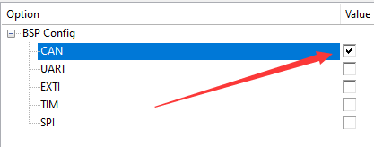
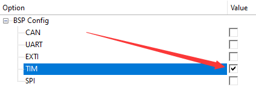
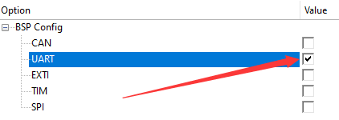

# BSP 系列模块

注：本readme包含对bsp驱动相关的一系列模块的说明

---

## CAN 驱动模块

### 模块介绍

本模块将单片机CAN外设与软总线进行对接，提供了软总线接口用于发送和接收CAN数据帧

**循环帧**：除了发送普通单帧外，本模块还可以定时发送8字节的`循环帧`，用户通过软总线设置其中的部分字节时，其他字节保持不变（主要用于驱动大疆CAN电机）

### 模块依赖项

#### 模块依赖

- 服务类模块
	- 无
- 工具类模块
	- 无

#### 文件依赖

- 本模块文件
	- `bsp_can.c`（必选）
- 底层库文件 
	- `cmsis_os.h`、`can.h`（必选）

#### 其他依赖

- 无

### 准备工作

1. 根据外设需求在CubeMX中配置，此处不详述操作细节
2. 在`sys_conf.h`中使用[图形化配置](../../conf/README.md/#sys_confh语法)，勾选CAN
    

### 模块配置项

1. 模块配置项
    
    | 配置名 | 数值类型 | 默认值 | 说明 |
    | :---: | :---: | :---: | :---: |
    | `cans`           | `CF_DICT` | / | 配置can信息[>>>](#can2)  |
    | `repeat-buffers` | `CF_DICT` | / | 配置循环帧[>>>](#can4) |

2. <span id='can2'/>`cans`配置项

    | 配置名 | 数值类型 | 默认值 | 说明 |
	| :---: | :---: | :---: | :---: |
	| `0` | `CF_DICT` | / | 第一个can配置 [>>>](#can3) |
	| `1` | `CF_DICT` | / | 第二个can配置 (格式同上) |
	| `...` | `CF_DICT` | / | 其他can配置 (格式同上) |

	> 注：配置名必须从0开始依次编号

3. <span id='can3'/>`cans`子元素配置项

    | 配置名 | 数值类型 | 默认值 | 说明 |
    | :---: | :---: | :---: | :---: |
    | `hcan`   | `CAN_HandleTypeDef*` | NULL | can句柄 |
    | `number` | `uint8_t` | 0               | can控制器编号，就是canX的X |

4. <span id='can4'/>`repeat-buffers`配置项

    | 配置名 | 数值类型 | 默认值 | 说明 |
	| :---: | :---: | :---: | :---: |
	| `0` | `CF_DICT` | / | 第一个循环帧配置 [>>>](#can5) |
	| `1` | `CF_DICT` | / | 第二个循环帧配置 (格式同上) |
	| `...` | `CF_DICT` | / | 其他循环帧配置 (格式同上) |

	> 注：配置名必须从0开始依次编号

5. <span id='can5'/>`repeat-buffers`子元素配置项

    | 配置名 | 数值类型 | 默认值 | 说明 |
    | :---: | :---: | :---: | :---: |
    | `can-x`    | `uint8_t`  | 0    | 该循环帧与哪条can总线绑定 |
    | `id`       | `uint16_t` | 0x00 | 该循环帧的id |
    | `interval` | `uint16_t` | 100  | 该循环帧循环发送can帧的间隔时间(单位：ms) |

#### 配置示例

```c
{"can", CF_DICT{
    //CAN控制器信息
    {"cans", CF_DICT{
        {"0", CF_DICT{
            {"hcan", &hcan1},  //can句柄
            {"number", IM_PTR(uint8_t, 1)},  //can控制器编号，就是canX的X
            CF_DICT_END
        }},
        {"1", CF_DICT{
            {"hcan", &hcan2},
            {"number", IM_PTR(uint8_t, 2)},
            CF_DICT_END
        }},
        CF_DICT_END
    }},
    //循环帧配置
    {"repeat-buffers", CF_DICT{
        {"0", CF_DICT{
            {"can-x", IM_PTR(uint8_t, 1)}, //can几
            {"id", IM_PTR(uint16_t, 0x200)}, //循环帧的id
            {"interval", IM_PTR(uint16_t, 2)}, //循环帧的发送间隔
            CF_DICT_END
        }},
        {"1",CF_DICT{
            {"can-x", IM_PTR(uint8_t, 1)},
            {"id", IM_PTR(uint16_t, 0x1FF)},
            {"interval", IM_PTR(uint16_t, 2)},          
            CF_DICT_END
        }},
        {"2",CF_DICT{
            {"can-x", IM_PTR(uint8_t, 2)},
            {"id", IM_PTR(uint16_t, 0x200)},
            {"interval", IM_PTR(uint16_t, 2)},          
            CF_DICT_END
        }},		
        {"3", CF_DICT{
            {"can-x", IM_PTR(uint8_t, 2)},
            {"id", IM_PTR(uint16_t, 0x1FF)},
            {"interval", IM_PTR(uint16_t, 2)},
            CF_DICT_END
        }},
        CF_DICT_END
    }},
    CF_DICT_END
}},
```

### 软总线接口

#### 广播接口

- **广播can总线接收的原始数据**：`/<can_>/recv`
  
    > 例如：如果是CAN1收到数据，其广播名为`/can1/recv`

    - **广播类型**：快速方式（列表数据帧）
    
    - **数据帧格式**

        | 索引 | 数据类型 | 说明 |
        | :---: | :---: | :---: |
        | `0` | `uint16_t` | can数据帧StdID |
        | `1` | `uint8_t[8]` | 接收到的can数据 |

#### 远程函数
  
- **设置循环帧的部分数据字节**： `/can/set-buf`
    
    参数格式如下

    | 数据字段名 | 数据类型 | 是否为返回值 | 是否必须传输 | 说明 |
    | :---: | :---: | :---: | :---: | :---: |
    | `can-x`| `uint8_t` | × | 必须 | canX的X     |
    | `id`	 | `uint16_t`| × | 必须 | can数据帧StdID |
    | `pos`	 | `uint8_t` | × | 必须 | 覆盖循环帧数据域起始字节位置  |
    | `len`	 | `uint8_t` | × | 必须 | 需要覆盖循环帧长度(字节) |
    | `data` | `uint8_t[len]`| × | 必须 | 覆盖循环帧的数据 |

	> 解释：该接口会设置指定ID的循环帧中从pos开始的长度为len的数据为data

- **发送一帧can数据**：`/can/send-once`
    
    参数格式如下

    | 数据字段名 | 数据类型 | 是否为返回值 | 是否必须传输 | 说明 |
    | :---: | :---: | :---: | :---: | :---: |
    | `can-x`| `uint8_t` | × | 必须 | canX的X     |
    | `id`	 | `uint16_t`| × | 必须 | can数据帧StdID |
    | `data` | `uint8_t[8]`| × | 必须 | 数据帧内容 |

---

## EXTI 驱动模块

### 模块介绍

本模块将外部中断对接到软总线中，可以在外部中断触发时发送广播

### 模块依赖项

#### 模块依赖

- 服务类模块
	- 无
- 工具类模块
	- 无

#### 文件依赖

- 本模块文件
	- `bsp_exti.c`（必选）
- 底层库文件 
	- `cmsis_os.h`、`gpio.h`（必选）

#### 其他依赖

- 无

### 准备工作

1. 根据外设需求在CubeMX中配置，此处不详述操作细节
2. 在`sys_conf.h`中使用[图形化配置](../../conf/README.md/#sys_confh语法)，勾选EXTI
    

### 模块配置项

1. 模块配置项

    | 配置名 | 数值类型 | 默认值 | 说明 |
    | :---: | :---: | :---: | :---: |
    | `extis` | `CF_DICT` | / | 配置外部中断信息[>>>](#exti2) |

2. <span id='exti2'/>`extis`配置项

    | 配置名 | 数值类型 | 默认值 | 说明 |
	| :---: | :---: | :---: | :---: |
	| `0` | `CF_DICT` | / | 第一个外部中断配置 [>>>](#exti3) |
	| `1` | `CF_DICT` | / | 第二个外部中断配置 (格式同上) |
	| `...` | `CF_DICT` | / | 其他外部中断配置 (格式同上) |

	> 注：配置名必须从0开始依次编号

3. <span id='exti3'/>`extis`子元素配置项

    | 配置名 | 数值类型 | 默认值 | 说明 |
    | :---: | :---: | :---: | :---: |
    | `gpio-x` | `GPIO_TypeDef*` | NULL | 由哪个gpio触发外部中断，如：PA4触发则为GPIOA |
    | `pin-x`  | `uint8_t`       | 0    | 由哪个gpio触发外部中断，如：PA4触发则为4 |

#### 配置示例

```c
{"exti",CF_DICT{
	{"extis",CF_DICT{
		{"0",CF_DICT{
			{"gpio-x", GPIOA},
			{"pin-x",IM_PTR(uint8_t,0)}, 
			CF_DICT_END
		}},
		{"1",CF_DICT{
			{"gpio-x", GPIOA},
			{"pin-x",IM_PTR(uint8_t,4)},
			CF_DICT_END
		}},
		CF_DICT_END
	}},
	CF_DICT_END
}},
```

### 软总线接口

#### 广播接口

- **外部中断触发事件**： `/exti/<pin_>`

    > 例如：若pin1中断线发生了外部中断，其广播名为`/exti/pin1`
    
    - **广播类型**：快速方式（列表数据帧）
    
    - **数据帧格式**

        | 索引 | 数据类型 | 说明 |
        | :---: | :---: | :---: |
        | `0` | `GPIO_PinState` | 触发外部中断的电平 |

#### 远程函数接口

本模块暂无远程函数接口

---

## SPI 驱动模块

### 模块介绍

本模块将单片机SPI外设对接到软总线中，提供了阻塞方式和DMA方式的软总线接口

**互斥特性**：由于同一时刻下SPI主机只能与一个从机通信，本模块使用FreeRTOS信号量对通信中的从机进行了锁定，以防不同线程同时访问不同外设

### 模块依赖项

#### 模块依赖

- 服务类模块
	- 无
- 工具类模块
	- 无

#### 文件依赖

- 本模块文件
	- `bsp_spi.c`（必选）
- 底层库文件 
	- `cmsis_os.h`、`spi.h`、`gpio.h`（必选）

#### 其他依赖

- 无

### 准备工作

1. 根据外设需求在CubeMX中配置，此处不详述操作细节
2. 在`sys_conf.h`中使用[图形化配置](../../conf/README.md/#sys_confh语法)，勾选SPI
    

### 模块配置项

1. 模块配置项
    
    | 配置名 | 数值类型 | 默认值 | 说明 |
    | :---: | :---: | :---: | :---: |
    | `spis` | `CF_DICT` | / | 配置spi信息[>>>](#spi2) |

2. <span id='spi2'/>`spis`配置项
   
    | 配置名 | 数值类型 | 默认值 | 说明 |
	| :---: | :---: | :---: | :---: |
	| `0` | `CF_DICT` | / | 第一个spi配置 [>>>](#spi3) |
	| `1` | `CF_DICT` | / | 第二个spi配置 (格式同上) |
	| `...` | `CF_DICT` | / | 其他spi配置 (格式同上) |

	> 注：配置名必须从0开始依次编号

3. <span id='spi3'/>`spis`子元素配置项

    | 配置名 | 数值类型 | 默认值 | 说明 |
    | :---: | :---: | :---: | :---: |
    | `hspi`          | `SPI_HandleTypeDef*` | NULL | spi句柄 |
    | `number`        | `uint8_t` | 0               | spiX的X |
    | `max-recv-size` | `uint8_t` | 1               | spi接收缓存区大小 |
    | `cs`            | `CF_DICT` | /              | 配置spi片选信息[>>>](#spi4) |

4. <span id='spi4'/>`cs`配置项

    | 配置名 | 数值类型 | 默认值 | 说明 |
	| :---: | :---: | :---: | :---: |
	| `0` | `CF_DICT` | / | 第一个spi片选配置 [>>>](#spi5) |
	| `1` | `CF_DICT` | / | 第二个spi片选配置 (格式同上) |
	| `...` | `CF_DICT` | / | 其他spi片选配置 (格式同上) |

	> 注：配置名必须从0开始依次编号

5. <span id='spi5'/>`cs`子元素配置项

    | 配置名 | 数值类型 | 默认值 | 说明 |
    | :---: | :---: | :---: | :---: |
    | `gpio` | `GPIO_TypeDef*` | NULL | 片选的gpio |
    | `pin`  | `uint8_t`       | 0    | 片选的gpio |
    | `name` | `char*`         | NULL | 片选名，在调用远程函数时使用，用于选择与哪一个从机通信 |

#### 配置示例：

```c
{"spi",CF_DICT{
	{"spis",CF_DICT{
		{"0",CF_DICT{
			{"hspi", &hspi1},
			{"number",IM_PTR(uint8_t,1)},
			{"max-recv-size",IM_PTR(uint8_t,10)},
			{"cs",CF_DICT{
				{"0",CF_DICT{
					{"pin", IM_PTR(uint8_t,0)},
					{"name", "gyro"},
					{"gpio-x", GPIOB},
					CF_DICT_END
				}},
				{"1",CF_DICT{
					{"pin", IM_PTR(uint8_t,4)},
					{"name", "acc"},
					{"gpio-x", GPIOA},
					CF_DICT_END
				}},          
				CF_DICT_END
				}},
			CF_DICT_END
			}},
		CF_DICT_END
		}},
	CF_DICT_END
}},
```

### 软总线接口

#### 广播接口

- **在使用dma发送后广播spi接收的数据**：`/<spi_>/recv`

    > 例如：如果是spi1收到数据，其广播名为`/spi1/recv`

    - **广播类型**：快速方式（列表数据帧）
    
    - **数据帧格式**

        | 索引 | 数据类型 | 说明 |
        | :---: | :---: | :---: |
        | `0` | `uint8_t[]` | 接收到的spi数据 |
        | `1` | `uint16_t` | 接收到的spi数据的长度 |

#### 远程函数接口
  
- **使用阻塞方式进行spi通信**：`/spi/block`

    参数格式如下
  
    | 数据字段名 | 数据类型 | 是否为返回值 | 是否必须传输 | 说明 |
    | :---: | :---: | :---: | :---: | :---: |
    | `spi-x`   | `uint8_t`  | × | 必须 | spiX的X     |
    | `tx-data` | `uint8_t[len]` | × | 必须 | spi发送数据 |
    | `rx-data` | `uint8_t[len]` | √ | 可选 | spi接收保存区，若不传入则使用库内部spi缓冲区  |
    | `len`     | `uint16_t` | × | 必须 | spi传输数据长度(字节) |
    | `timeout` | `uint32_t` | × | 必须 | spi阻塞式发送等待的超时时间 |
	| `cs-name` | `char*`    | × | 必须 | 片选名，与在配置表中CS引脚的`name`项一致 |
    | `is-block`| `bool`     | × | 必须 | 如果spi正在通信是否阻塞等待上一个设备通信结束后再通信 |
    
- **使用DMA方式进行spi通信**：`/spi/trans/dma`

    参数格式如下
  
    | 数据字段名 | 数据类型 | 是否为返回值 | 是否必须传输 | 说明 |
    | :---: | :---: | :---: | :---: | :---: |
    | `spi-x`   | `uint8_t`  | × | 必须 | spiX的X     |
    | `tx-data` | `uint8_t[len]` | × | 必须 | spi发送数据 |
    | `rx-data` | `uint8_t[len]` | √ | 可选 | spi接收保存区，若不传入则使用库内部spi缓冲区  |
    | `len`     | `uint16_t` | × | 必须 | spi传输数据长度(字节) |
	| `cs-name` | `char*`    | × | 必须 | 片选名，与在配置表中CS引脚的`name`项一致 |
    | `is-block`| `bool`     | × | 必须 | 如果spi正在通信是否阻塞等待上一个设备通信结束后再通信 |

---

## TIM 驱动模块

### 模块依赖项

#### 模块依赖

- 服务类模块
	- 无
- 工具类模块
	- 无

#### 文件依赖

- 本模块文件
	- `bsp_tim.c`（必选）
- 底层库文件 
	- `cmsis_os.h`、`tim.h`（必选）

#### 其他依赖

- 无

### 准备工作

1. 根据外设需求在CubeMX中配置，此处不详述操作细节
2. 在`sys_conf.h`中使用[图形化配置](../../conf/README.md/#sys_confh语法)，勾选TIM
    

### 模块配置项

1. 模块配置项
    
    | 配置名 | 数值类型 | 默认值 | 说明 |
    | :---: | :---: | :---: | :---: |
    | `tims` | `CF_DICT` | / | 配置tim信息[>>>](#tim2) |

2. <span id='tim2'/>`tims`配置项
   
    | 配置名 | 数值类型 | 默认值 | 说明 |
	| :---: | :---: | :---: | :---: |
	| `0` | `CF_DICT` | / | 第一个定时器配置 [>>>](#tim3) |
	| `1` | `CF_DICT` | / | 第二个定时器配置 (格式同上) |
	| `...` | `CF_DICT` | / | 其他定时器配置 (格式同上) |

	> 注：配置名必须从0开始依次编号

3. <span id='tim3'/>`tims`子元素配置项

    | 配置名 | 数值类型 | 默认值 | 说明 |
    | :---: | :---: | :---: | :---: |
    | `htim`   | `TIM_HandleTypeDef*` | NULL | tim句柄 |
    | `number` | `uint8_t`            | 0    | timX的X |
    | `mode`   | `char*`              | NULL | 定时器运行模式，可选`NULL`、`"encode"`、`"pwm"` |

#### 配置示例：

```c
{"tim",CF_DICT{
	{"tims",CF_DICT{
		{"0",CF_DICT{ //相当于数组下标，在一个配置名下如果有多个配置项的话，需要按顺序依次顺序输入
			{"htim",&htim2}, //tim句柄
			{"number",IM_PTR(uint8_t,2)}, //timX的X
			{"mode","encode"},
			CF_DICT_END
		}},
		{"1",CF_DICT{
			{"htim",&htim1},
			{"number",IM_PTR(uint8_t,1)},
			{"mode","pwm"},
			CF_DICT_END
		}}, 
		CF_DICT_END
	}},
	CF_DICT_END
}},
```

### 软总线接口

#### 广播接口

本模块暂无广播接口
    
#### 远程函数接口
  
- **设置PWM占空比**：`/tim/pwm/set-duty`

    参数格式如下
  
    | 数据字段名 | 数据类型 | 是否为返回值 | 是否必须传输 | 说明 |
    | :---: | :---: | :---: | :---: | :---: |
    | `tim-x`     | `uint8_t` | × | 必须 | timX的X     |
    | `channel-x` | `uint8_t` | × | 必须 | 定时器的通道几 |
    | `duty`      | `float`   | × | 必须 | PWM的占空比 **(范围0-1)**  |
    
- **获取当前编码器值**：`/tim/encode`

    参数格式如下
  
    | 数据字段名 | 数据类型 | 是否为返回值 | 是否必须传输 | 说明 |
    | :---: | :---: | :---: | :---: | :---: |
    | `tim-x`       | `uint8_t`  | × | 必须 | timX的X     |
    | `count`       | `uint32_t` | √ | 必须 | 返回当前编码器的值 |
    | `auto-reload` | `uint8_t*` | √ | 可选 | 返回cubemx配置的该定时器的自动重装值  |

---

## UART 驱动模块

### 模块介绍

本模块提供了进行串口收发的软总线接口，提供了阻塞、中断、DMA三种方式发送数据，并在收到空闲中断时广播接收的一帧数据

### 模块依赖项

#### 模块依赖

- 服务类模块
	- 无
- 工具类模块
	- 无

#### 文件依赖

- 本模块文件
	- `bsp_usart.c`（必选）
- 底层库文件 
	- `cmsis_os.h`、`usart.h`（必选）

#### 其他依赖

- 无

### 准备工作

1. 根据外设需求在CubeMX中配置，此处不详述操作细节
2. 由于此模块在自己定义的中断服务函数实现了对空闲中断的处理，因此需要在CubeMX工程NVIC的代码生成中，取消生成串口的中断服务函数，如下图所示
    
3. 在`sys_conf.h`中使用[图形化配置](../../conf/README.md/#sys_confh语法)，勾选UART
    

### 模块配置项

1. 模块配置项
    
    | 配置名 | 数值类型 | 默认值 | 说明 |
    | :---: | :---: | :---: | :---: |
    | `uarts` | `CF_DICT` | / | 配置串口信息[>>>](#uart2) |

2. <span id='uart2'/>`uarts`配置项
    
    | 配置名 | 数值类型 | 默认值 | 说明 |
	| :---: | :---: | :---: | :---: |
	| `0` | `CF_DICT` | / | 第一个串口配置 [>>>](#uart3) |
	| `1` | `CF_DICT` | / | 第二个串口配置 (格式同上) |
	| `...` | `CF_DICT` | / | 其他串口配置 (格式同上) |

	> 注：配置名必须从0开始依次编号

3. <span id='uart3'/>`uarts`子元素配置项

    | 配置名 | 数值类型 | 默认值 | 说明 |
    | :---: | :---: | :---: | :---: |
    | `huart`         | `UART_HandleTypeDef*` | NULL | 串口句柄 |
    | `number`        | `uint8_t`             | 0    | uartX的X |
    | `max-recv-size` | `uint16_t`            | 1    | 串口缓存区 |

#### 配置示例：

```c
{"uart",CF_DICT{
	{"uarts",CF_DICT{
		{"0",CF_DICT{
			{"huart",&huart1},
			{"number",IM_PTR(uint8_t,1)},
			{"max-recv-size",IM_PTR(uint16_t,100)},
			CF_DICT_END
		}},
		{"1",CF_DICT{
			{"huart",&huart3},
			{"number",IM_PTR(uint8_t,3)},
			{"max-recv-size",IM_PTR(uint16_t,18)},
			CF_DICT_END
		}},
		{"2",CF_DICT{
			{"huart",&huart6},
			{"number",IM_PTR(uint8_t,6)},
			{"max-recv-size",IM_PTR(uint16_t,300)},
			CF_DICT_END
		}},
		CF_DICT_END
	}},	
	CF_DICT_END
}},
```

### 软总线接口

### 广播接口
    
- **广播串口接收到的一帧数据**：`/<uart_>/recv`

    > 例如：串口1收到数据时的广播名为`/uart1/recv`

	> 注：本模块使用空闲中断断帧，产生该中断时判定为收到一帧数据，然后发送此广播

    - **广播类型**：快速方式（列表数据帧）

    - **数据帧格式**

        | 索引 | 数据类型 | 说明 |
        | :---: | :---: | :---: |
        | `0` | `uint8_t[]` | 接收到的串口数据 |
        | `1` | `uint16_t` | 接收到的串口数据的长度 |

#### 远程函数接口
  
- **使用阻塞方式进行spi通信**：`/uart/trans/block`

    参数格式如下
  
    | 数据字段名 | 数据类型 | 是否为返回值 | 是否必须传输 | 说明 |
    | :---: | :---: | :---: | :---: | :---: |
    | `uart-x`    | `uint8_t`  | × | 必须 | uartX的X     |
    | `data`      | `uint8_t[trans-size]` | × | 必须 | 串口发送数据 |
    | `trans-size` | `uint16_t` | × | 必须 | 串口发送数据长度  |
    | `timeout`   | `uint32_t` | × | 必须 | 串口阻塞式发送等待的超时时间 |
    
- **使用中断方式发送数据**：`/uart/trans/it`

	参数格式如下
  
    | 数据字段名 | 数据类型 | 是否为返回值 | 是否必须传输 | 说明 |
    | :---: | :---: | :---: | :---: | :---: |
    | `uart-x`    | `uint8_t`  | × | 必须 | uartX的X     |
    | `data`      | `uint8_t[trans-size]` | × | 必须 | 串口发送数据 |
    | `trans-size` | `uint16_t` | × | 必须 | 串口发送数据长度  |

- **使用DMA方式发送数据**：`/uart/trans/dma`

	参数格式如下
  
    | 数据字段名 | 数据类型 | 是否为返回值 | 是否必须传输 | 说明 |
    | :---: | :---: | :---: | :---: | :---: |
    | `uart-x`    | `uint8_t`  | × | 必须 | uartX的X     |
    | `data`      | `uint8_t[trans-size]` | × | 必须 | 串口发送数据 |
    | `trans-size` | `uint16_t` | × | 必须 | 串口发送数据长度  |
