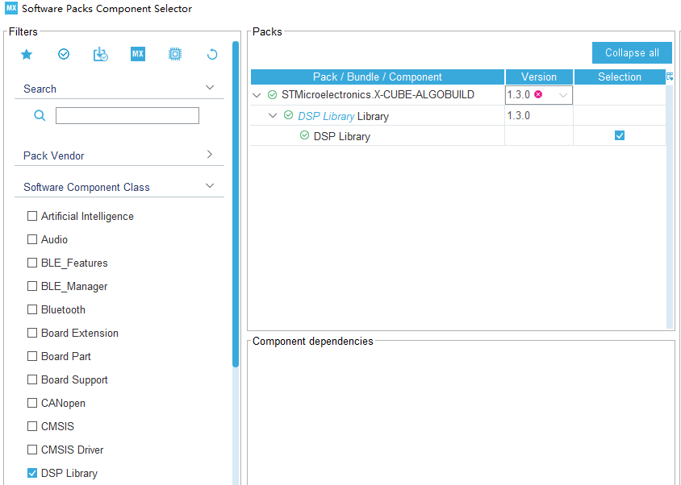

# 底盘模块

---

## 简介

这是整个代码库的底盘模块，根据用户设置的速度、加速度、和坐标系分离角计算出电机相应的转速目标值


## 模块依赖项

- 本项目文件
	- `softbus.c/h`、`config.c/h`、`slope.c/h`、`motor.c/h`(及其使用到的电机子类)
- hal库文件 
    - `cmsis_os.h`、`arm_math.h`
- 系统广播
    - `/system/stop`：在监听到该广播后会设置该模块下所有电机进入急停模式

---

> 注：下面远程函数所写的数据类型为指针的项仅强调该项传递的应该是数组，实际传递的参数只需数组名即可，不需要传递数组名的地址。广播也是如此，所写的数据类型若为指针的仅强调该项传递的应该是数组，获取该项的值是仅需要强制类型转换成相应的指针即可，无需额外解引用

---

## 说明
1. 坐标系分离角：为用户坐标系和底盘坐标系之间的夹角。例如：当云台与底盘夹角45°时，此时如果按下前进按钮，应当以云台朝向方向前进而非底盘坐标系的y轴正方向，此时向底盘模块输入分离角，会解算出输入方向的速度映射到底盘坐标系下实际的速度
2. 由于此模块使用了`arm_math.h`来加速三角函数，因此需要[开启DSP库](#在STM32CubeMX中需要的配置)。

## 在STM32CubeMX中需要的配置

1. 打开CubeMX工程,添加DSP库
   - 打开Select Components
  
   
   - 选择DSP Library
  
	
   - 返回cubeMX,添加DSP Library

   

   - 将所有库拷贝到工程文件夹下

   
	
2. 打开Keil工程
   - 在全局宏定义处添加 `,ARM_MATH_CM4,__TARGET_FPU_VFP,__FPU_PRESENT=1U` ,以打开FPU
   
   
   - 修改Keil工程包含目录，删除原有的`arm_cortexM4l_math.lib`,添加\Drivers\CMSIS\Lib\ARM目录下`arm_cortexM4lf_math.lib`

   

## 在`sys_conf.h`中的配置

```c
{"chassis", CF_DICT{
		//任务循环周期
		{"taskInterval", IM_PTR(uint8_t, 2)},
		//底盘尺寸信息
		{"info", CF_DICT{
			{"wheelbase", IM_PTR(float, 100)},
			{"wheeltrack", IM_PTR(float, 100)},
			{"wheel-radius", IM_PTR(float, 76)},
			{"offset-x", IM_PTR(float, 0)},
			{"offset-y", IM_PTR(float, 0)},
			CF_DICT_END
		}},
		//底盘移动速度/加速度配置
		{"move", CF_DICT{
			{"max-vx", IM_PTR(float, 2000)},
			{"max-vy", IM_PTR(float, 2000)},
			{"max-vw", IM_PTR(float, 2)},
			{"x-acc", IM_PTR(float, 1000)},
			{"y-acc", IM_PTR(float, 1000)},
			CF_DICT_END
		}},
		//四个电机配置
		{"motor-fl", CF_DICT{
			{"type", "M3508"},
			{"id", IM_PTR(uint16_t, 1)},
			{"can-x", IM_PTR(uint8_t, 1)},
//			{"reduction-ratio", IM_PTR(float, 1)},   //若使用改装减速箱或者拆掉减速箱的电机则修改此参数，若使用原装电机则无需配置此参数
			{"speed-pid", CF_DICT{
				{"p", IM_PTR(float, 10)},
				{"i", IM_PTR(float, 1)},
				{"d", IM_PTR(float, 0)},
				{"max-i", IM_PTR(float, 10000)},
				{"max-out", IM_PTR(float, 20000)},
				CF_DICT_END
			}},
			CF_DICT_END
		}},
		{"motor-fr", CF_DICT{
			{"type", "M3508"},
			{"id", IM_PTR(uint16_t, 2)},
			{"can-x", IM_PTR(uint8_t, 1)},
			{"speed-pid", CF_DICT{
				{"p", IM_PTR(float, 10)},
				{"i", IM_PTR(float, 1)},
				{"d", IM_PTR(float, 0)},
				{"max-i", IM_PTR(float, 10000)},
				{"max-out", IM_PTR(float, 20000)},
				CF_DICT_END
			}},
			CF_DICT_END
		}},
		{"motor-bl", CF_DICT{
			{"type", "M3508"},
			{"id", IM_PTR(uint16_t, 3)},
			{"can-x", IM_PTR(uint8_t, 1)},
			{"speed-pid", CF_DICT{
				{"p", IM_PTR(float, 10)},
				{"i", IM_PTR(float, 1)},
				{"d", IM_PTR(float, 0)},
				{"max-i", IM_PTR(float, 10000)},
				{"max-out", IM_PTR(float, 20000)},
				CF_DICT_END
			}},
			CF_DICT_END
		}},
		{"motor-br", CF_DICT{
			{"type", "M3508"},
			{"id", IM_PTR(uint16_t, 4)},
			{"can-x", IM_PTR(uint8_t, 1)},
			{"speed-pid", CF_DICT{
				{"p", IM_PTR(float, 10)},
				{"i", IM_PTR(float, 1)},
				{"d", IM_PTR(float, 0)},
				{"max-i", IM_PTR(float, 10000)},
				{"max-out", IM_PTR(float, 20000)},
				CF_DICT_END
			}},
			CF_DICT_END
		}},
		CF_DICT_END
	}},
```

## 模块接口

- 广播：无

- 远程函数
  
    1. `/<chassis_name>/speed`

        说明：设置底盘在用户坐标系下的速度，`<chassis_name>`为可以替换部分，例如：在配置文件中添加`{"chassis", "mecanum"},`就可以将默认的`/chassis/speed`，替换成`/mecanum/speed`

        传入参数数据：

        | 数据字段名 | 数据类型 | 是否为返回值 | 是否必须传输 | 说明 |
        | :---: | :---: | :---: | :---: | :---: |
        | `vx` | `float` | × | 可选 | 底盘在用户坐标系下x轴方向的速度(单位mm/s) |
        | `vy` | `float` | × | 可选 | 底盘在用户坐标系下y轴方向的速度(单位mm/s) |
        | `vw` | `float` | × | 可选 | 底盘旋转的角速度(单位°/s)  |
    
    2. `/<chassis_name>/acc`

        说明：设置底盘在用户坐标系下的加速度，`<chassis_name>`为可以替换部分，例如：在配置文件中添加`{"chassis", "mecanum"},`就可以将默认的`/chassis/acc`，替换成`/mecanum/acc`


        传入参数数据：

        | 数据字段名 | 数据类型 | 是否为返回值 | 是否必须传输 | 说明 |
        | :---: | :---: | :---: | :---: | :---: |
        | `ax` | `float` | × | 可选 | 底盘在用户坐标系下x轴方向的加速度(单位mm/s²) |
        | `ay` | `float` | × | 可选 | 底盘在用户坐标系下y轴方向的加速度(单位mm/s²) |
    
    3. `/<chassis_name>/relative-angle`

        说明：设置用户坐标系和底盘坐标系的分离角，`<chassis_name>`为可以替换部分，例如：在配置文件中添加`{"chassis", "mecanum"},`就可以将默认的`/chassis/relative-angle`，替换成`/mecanum/relative-angle`

        传入参数数据：

        | 数据字段名 | 数据类型 | 是否为返回值 | 是否必须传输 | 说明 |
        | :---: | :---: | :---: | :---: | :---: |
        | `angle` | `float` | × | 必须 | 底用户坐标系和底盘坐标系的分离角(单位°/s) |
