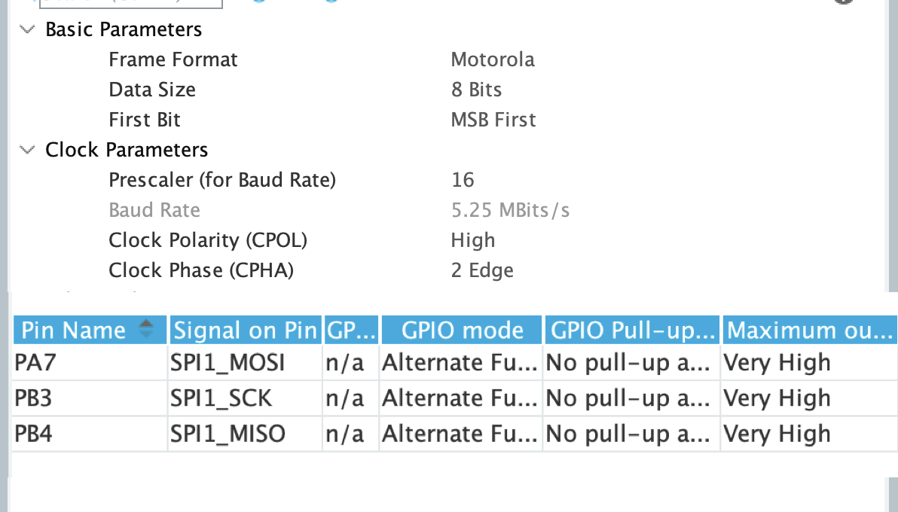

# INS 模块

---

## 模块介绍

1. 这是整个代码库的惯导系统模块，根据 imu 的驱动获取 imu 的角速度和加速度，进而进行姿态解算出当前 imu 坐标系的姿态角同时广播出去
2. 目前 bmi088 配置未开放到`sys_conf.h`，如需要修改加速度计或陀螺仪量程等请到`bmi088_driver.c`中修改命令表的值，目前使用的是 mahony 算法作为姿态解算算法

## 模块依赖项

### 模块依赖

- 服务类模块
  - [定时器模块](../bsp/README.md)（可选）
- 工具类模块
  - [滤波器模块](../../tools/first_order_filter/README.md)（可选）
  - [PID 模块](../../tools/controller/README.md)（可选）

### 文件依赖

- 本模块文件
  - `ins.c`（必选）
- 硬件驱动文件
  - `bmi088_driver.c/h`（必选）、`AHRS_MiddleWare.c/h`（必选）、`AHRS.lib/h`（必选）
- 底层库文件
  - `cmsis_os.h`（必选）

---

## 准备工作

1. 在 CubeMX 中配置 spi

   

   **注：请使用图示的备用引脚定义**

## 模块配置项

1. 模块配置项

   |        配置名        |  数值类型  | 默认值  |                            说明                             |
   | :------------------: | :--------: | :-----: | :---------------------------------------------------------: |
   |   `task-interval`    | `uint16_t` |    2    |                        任务执行间隔                         |
   |        `name`        |  `char*`   | `"ins"` |                     本服务的运行时名称                      |
   |       `spi-x`        | `uint8_t`  |    0    |                      imu 外设所在 spi                       |
   | `target-temperature` |  `float`   |   40    |                        imu 目标温度                         |
   |       `tim-x`        | `uint8_t`  |   10    |                      温控 pwm 所在 tim                      |
   |     `channel-x`      | `uint8_t`  |    1    |                   温控 pwm 所在 tim 通道                    |
   |      `tmp-pid`       | `CF_DICT`  |    /    | 温控 pid[>>>](../../tools/controller/README.md/#模块配置项) |

### 配置示例：

```c
{"ins",CF_DICT{
	{"spi-x",IM_PTR(uint8_t,1)},
	{"tim-x",IM_PTR(uint8_t,10)},
	{"channel-x",IM_PTR(uint8_t,1)},
	{"tmp-pid", CF_DICT{
		{"p", IM_PTR(float, 0.15)},
		{"i", IM_PTR(float, 0.01)},
		{"d", IM_PTR(float, 0)},
		{"max-i", IM_PTR(float, 0.15)},
		{"max-out", IM_PTR(float, 1)},
		CF_DICT_END
	}},
	CF_DICT_END
}},
```

## 软总线接口

> 注：下述广播和远程函数名称中`<ins_name>`代表服务配置表中`name`配置项的值

### 广播接口

- **广播 imu 坐标系下 3 轴欧拉角**：`/<ins_name>/euler-angle`

  - **广播类型**：普通方式（映射表数据帧）

    - **数据帧格式**

    | 数据字段名 | 数据类型 |                 说明                 |
    | :--------: | :------: | :----------------------------------: |
    |   `yaw`    | `float`  |  imu 坐标系的 yaw 旋转角度(单位：°)  |
    |  `pitch`   | `float`  | imu 坐标系的 pitch 旋转角度(单位：°) |
    |   `roll`   | `float`  | imu 坐标系的 roll 旋转角度(单位：°)  |

### 远程函数接口

本模块暂无广播接口
