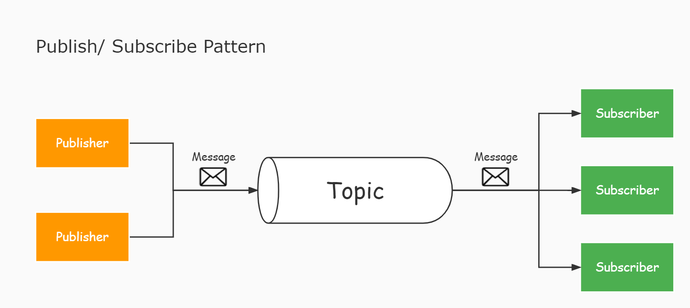

# 软总线

---

## 简介

本项目是一个订阅发布管理模块，以实现多模块间解耦，模块之间可以通过订阅、发布话题进行数据交互

---

## 项目文件及依赖项

- 本项目文件
	- `softbus.c/h`
- 标准库文件
	- `stdint.h`、`string.h`、`stdlib.h`
- 其他项目文件
	- `vector.c/h`：[通用类型变长数组](../tools/universal_vector/README.md)

---

## 发布订阅模式简介

发布订阅模式是一种数据传输的模式，用于提供不同模块之间的数据传输通道

在这个模式中有两个角色，发送数据的一方称为**发布者**(Pulisher)，接收数据的一方称为**订阅者**(Subscriber)，发布者可以创建多个**话题**(Topic)并在该话题上发布消息，订阅者会关注自己感兴趣的话题，并获取在该话题上所发布的消息



如上图所示，每个发布者/订阅者就是一个模块，一个话题就是一个字符串，每个话题可以视作一个通信管道，发布者通过“发布”操作向管道中写入数据，关注该管道的订阅者就可以收到数据

相较于传统方式中模块间直接调用对方的函数来传递数据，该模式使用字符串话题来标记所传输数据的意义，使得模块间不产生函数依赖和类型依赖，从而不产生文件依赖（无需相互引用对方的文件），以此实现模块间的松耦合

---

## 本模块概念阐述

- **软总线**：是对本模块作用的一种形象描述，系统中的所有模块通过本模块所提供的“订阅/发布”功能进行数据传输，可以将本模块看做系统中的一根“总线”，各个模块挂接在总线上相互传输数据
	> 注：本软总线与CAN通信等协议有一定相似之处，Topic的作用就类似于CAN数据帧ID，可用于标记数据帧的发送者或作用，订阅者订阅数据就相当于设置过滤器，过滤出总线上所发布的广播数据中感兴趣的部分
- **数据帧**(Frame)：在总线上所传输的数据是以“数据帧”为单位的，每次发布就是向软总线上发送一个数据帧
	- 数据帧是一个结构体，包含【数据】和【长度】两个信息
	- 数据帧分为两种，原始数据帧和映射表数据帧
    	- **原始数据帧**：数据帧中的数据指针直接指向所传输的数据，使用方便，用于传输简单数据
    	- **映射表数据帧**：数据帧中所传输的是一个映射表，需要在接收到后进行解码，可用于传输结构较复杂的数据
- **映射表**(Map)：由若干个“键-值”对构成，每个键是一个字符串，值为任意类型。每个键在表中只会出现一次，唯一对应着一个值，通过键即可找到所对应的值
	- 在本模块中一个“键-值”对被称为一个字段(Item)，其中包含【键】、【值】和【值的数据长度】
- **绑定数据**(bindData)：对于每一次订阅，订阅者可以绑定上一个自定义数据，在收到数据的同时也会收到该绑定数据
	> 例如：订阅者可以订阅一次topic1，此时绑定一个数据A，然后再次订阅topic1，并绑定一个数据B，那么当发布者在topic1上发布一次数据时，该订阅者可以收到两次数据，分别附带有所绑定的A和B

---

## 接口使用示例

**发布话题(发送数据)**
```c
/* 发布原始数据帧 */
uint8_t data[10] = {0xAA}; //要发布的数据
SoftBus_Publish("topic1", data, sizeof(data)); //向总线发布数据

/* 发布映射表数据帧 */
uint8_t value1 = 0x01; //要发布的第一个值
float value2 = 1.0f; //要发布的第二个值
SoftBus_PublishMap("topic2", {
	{"key1", &value1, sizeof(value1)},
	{"key2", &value2, sizeof(value2)}
}); //向总线上发布一个映射表数据帧
```

>注：当发送频率大于1kHz时，建议使用列表数据帧，因为可以获得话题句柄，通过句柄直接发布数据，这样可以减少字符串比较的时间

```c
/*发布列表数据帧*/
SoftBusFastHandle handle= SoftBus_GetFastHandle("topic3"); //获取话题句柄
uint16_t value = 0x201; //要发布的第一个值
uint8_t data[2] = {0x20, 0x01}; //要发布的第二个值
SoftBus_PublishFast(handle, {&value, data}); //向总线发布一个列表数据帧
```

**订阅话题(接收数据)**
```c
//定义软总线回调函数，收到数据时会自动调用
void callback(const char* topic, SoftBusFrame* frame, void* bindData)
{
	if(strcmp(topic, "topic1") == 0) //判断是哪个topic的数据
	{
		uint8_t* data = frame->data; //获取帧数据
		uint16_t length = frame->length; //获取数据长度
		/* ...其他处理逻辑 */
	}
	else if(strcmp(topic, "topic2") == 0)
	{
		const SoftBusItem* item1 = SoftBus_GetItem(frame, "key1"); //获取"key1"字段
		uint8_t value1 = *(uint8_t*)item1->data; //读取字段值
		const SoftBusItem* item2 = SoftBus_GetItem(frame, "key2"); //获取"key2"字段
		float value2 = *(float*)item2->data; //读取字段值
		/* ...其他处理逻辑 */
	}
}
//一般使用快速发布(即列表数据帧)是为了提高总线效率，因此通常使用单独的函数去订阅来提高效率
void fastCallback(const char* topic, SoftBusFrame* frame, void* bindData)
{
	uint16_t value; 
	value = *SoftBus_GetListPtr(frame, 0, uint16_t);//获取第一个值
	uint8_t* data = SoftBus_GetListPtr(frame, 1, uint8_t); //获取第二个值
	/* ...其他处理逻辑 */
}

//订阅话题
//方法1：订阅单个话题
SoftBus_Subscribe(NULL, callback, "topic1");
SoftBus_Subscribe(NULL, callback, "topic2");
//方法2：一次订阅多个话题
SoftBus_MultiSubscribe(NULL, callback, {"topic1", "topic2"});
//方法3：订阅快速发布的话题
SoftBus_Subscribe(NULL, fastCallback, "topic3");
```

---

## 注意事项

1. 不宜以极高频不使用快速句柄发布数据
	> 经测试，在已注册17个topic，其中一个topic注册了两个回调函数的条件下，软总线约有30kHz的传输频率
2. 若遇到发送频率大于1kHz的情况，建议使用快速句柄发布数据
    > 经测试，在使用快速句柄发布数据空跑回调函数时，软总线约有2MHz的传输频率
3. 回调函数是在发布者所在线程中执行的，因此回调函数的执行速度应尽可能快，切不可发生阻塞
	> 用`SoftBus_Publish`或`SoftBus_PublishMap`函数发布一个topic时，只有当订阅了该topic的所有回调函数执行结束后，该发布函数才会退出
3. 软总线仅会传输数据的地址(data指针)，且数据指针仅保证在回调函数范围内有效，若需在回调函数外使用这些数据，请在回调中拷贝整个数据，而不只是保存数据指针
4. 在回调函数中不应对传入的数据帧进行修改，否则会影响同一topic下的其他回调
