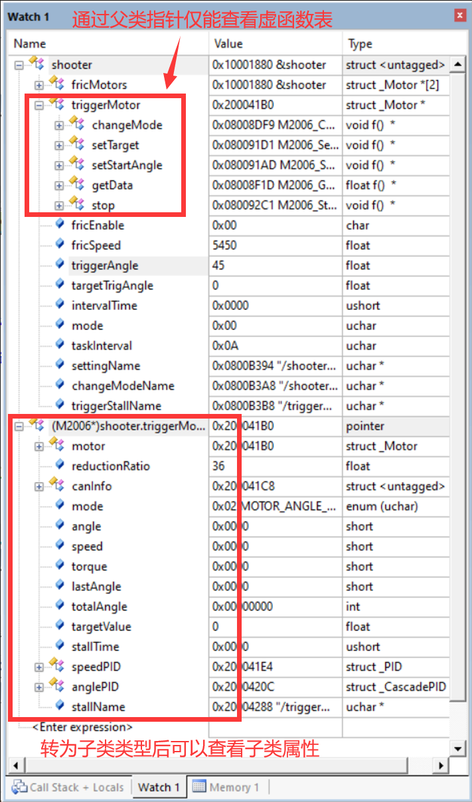

# 电机类

## 模块简介

1. 本项目实现了一个电机的抽象类，与C++中虚类类似，当子类被定义后父类的函数指针会指向子类的定义的函数，只需要调用父类的函数，而无需关心实际子类是如何具体实现的
2. 电机类结构介绍
    - 父类
        - 父类只提供方法的虚函数接口，不提供任何属性，根据配置表中选择的子类类型进行初始化
        - 父类的虚函数时所有子类的方法的最小公倍数集合，对于某些没有没有指向的函数指针会默认指向空函数(即什么也不会操作)
    - 子类
        - 子类继承父类(结构体的强制类型转换)，在其`.c`文件中会有子类独有的一些私有属性
        - 在子类初始化后会使父类的函数指针指向子类的实现
        - 目前现有的子类有：`m3508`、`m2006`、`m6020`、`直流电机`、`舵机`

## 模块依赖项

1. 文件依赖

    - 本项目文件
      	- `config.c/h`、`sys_conf.h`
  	- 标准库文件
    	- `stdint.h`、`stdlib.h`、`string.h`
    - hal库文件 
        - `cmsis_os.h`

## 准备工作
1. 将`motor.c/h`及其需要的子类文件添加至项目

## 模块配置项

```c
{"motor", CF_DICT{
	{"type", "M3508"}, //输入子类类型
	...                //根据子类需要的配置信息填入
	CF_DICT_END
}},
```
- 具体的子类的配置信息，详见[大疆电机](motor_can/README.md/#模块配置项)、[pwm电机](motor_pwm/README.md/#模块配置项)

## 接口说明

1. `Motor* Motor_Init(ConfItem* dict)`
   
   会根据传入的配置中的类型自动匹配对应的子类初始化函数同时只返回父类抽象接口不暴露实现细节。使用示例：

	```c
	Motor* motor = NULL;
	motor = Motor_Init(dict);
	```

2. 电机类中的`changeMode`接口

	通过此函数可以更改电机的控制模式，有直接的力矩输出、单级速度pid控制、串级角度pid控制。使用示例：

	```c
	Motor* motor = NULL;
	motor = Motor_Init(dict);
	motor->changeMode(motor, MOTOR_TORQUE_MODE);//力矩模式
	motor->changeMode(motor, MOTOR_SPEED_MODE);//速度模式
	motor->changeMode(motor, MOTOR_ANGLE_MODE);//角度模式
	```

3. 电机类中的`setTarget`接口

	通过此函数可以更改电机的目标值。在子类为非舵机类的情况下，会根据模式的不同目标值的物理含义也有所不同，如在速度模式下设置的目标值就是目标速度，在角度模式下设置的目标值就是目标角度。如果是舵机类，因为其只有角度模式，所以设置的就是目标角度。使用示例：

	```c
	Motor* motor = NULL;
	motor = Motor_Init(dict);
	motor->setTarget(motor, 60);
	```

4. 电机类中的`setStartAngle`接口

	通过此函数可以设置电机输出轴(不是转子)的开始角度。在刚上电时电机的角度不一定是在零点处，可以通过此函数设置电机输出轴的初始角度，之后会在pid的作用下达到归中的效果。使用示例：

	```c
	Motor* motor = NULL;
	motor = Motor_Init(dict);
	motor->setStartAngle(motor, -60);//单位：°
	```
5. 电机类中的`getData`接口

	通过此函数可以获取电机的部分数据。目前开放的数据有：转子距离编码器零点的角度和输出轴距离设置的零点的总角度。使用示例：

	```c
	Motor* motor = NULL;
	motor = Motor_Init(dict);
	motor->getData(motor, "angle");//获取转子角度，单位：°
	motor->getData(motor, "totalAngle");//获取输出轴总角度，单位：°
	```

6. 电机类中的`stop`接口

	通过此函数可以使电机进入急停模式，且进入后仅可以通过重启单片机退出。使用示例：

	```c
	Motor* motor = NULL;
	motor = Motor_Init(dict);
	motor->stop(motor);
	```

## 注意事项

1. 在调试过程中直接查看父类变量是不是暴露子类的私有属性的，若想在调试过程中查看子类的私有属性，只需要在调试变量窗口对父类变量强制类型转换即可。如：

	
